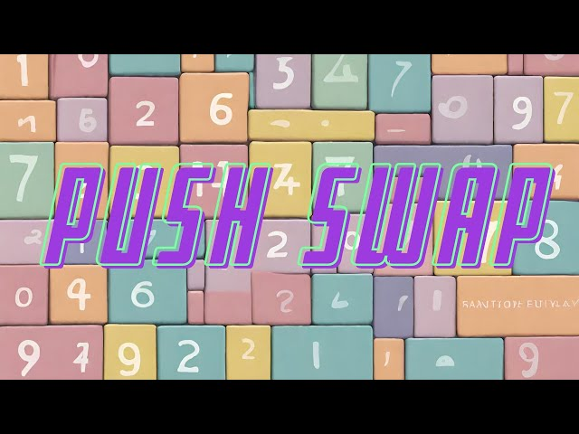

# Push-Swap

push-swap @ 1337 – 42 Network: numbers sorting program using stacks


## Table of Contents

- [About](#about)
- [Getting Started](#getting_started)
- [Usage](#usage)

## About <a name = "about"></a>

The Push-Swap project is a part of the 42 Network curriculum that focuses on data manipulation and sorting algorithms. The objective of this project is to create a program that sorts data on a stack, using a limited set of operations, in the least possible number of actions. This project not only tests your skills in sorting algorithms, but also your understanding of stack data structures and algorithmic efficiency. It's a challenging task that requires critical thinking and a deep understanding of the mechanics of data manipulation.

The operations allowed to manipulate the stacks are described as follows, as written in our task:

```
- sa : swap a - Swap the first 2 elements at the top of stack A. Do nothing if there is only one or no elements).
- sb : swap b - Swap the first 2 elements at the top of stack B. Do nothing if there is only one or no elements).
- ss : sa and sb at the same time.
- pa : push a - take the first element at the top of b and put it at the top of a. Do nothing if B is empty.
- pb : push b - take the first element at the top of a and put it at the top of b. Do nothing if A is empty.
- ra : rotate a - shift up all elements of stack A by 1. The first element becomes the last one.
- rb : rotate b - shift up all elements of stack B by 1. The first element becomes the last one.
- rr : ra and rb at the same time.
- rra : reverse rotate a - shift down all elements of stack A by 1. The last element becomes the first one.
- rrb : reverse rotate b - shift down all elements of stack B by 1. The last element becomes the first one.
- rrr : rra and rrb at the same time.
```

## Getting Started <a name = "getting_started"></a>

```
git clone git@github.com:lmakinaa/push-swap.git
cd push-swap
make
```

### Prerequisites

To run the build and run the program, you'll need:
- Clang

## Usage <a name = "usage"></a>

- The sorting program: ```./push_swap <random numbers to be sorted>```
	running that will output the necessary instructions to sort the numbers
- The checker program: ```./checker <the numbers to be checked>```
	after that, it will take the sorting instructions as an input.

- To get the instructions and check their accuracy, we can compose this bash command:
```
test="2 -45 0 1 99 -964"; ./push_swap $test > sort.log && cat sort.log | ./checker $test
```
